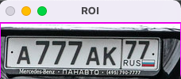

# Plate Number Detection
This script allows the user to enter a path to an image and then detects
the plate number if it is present. The detected plate number will be surrounded by
a rectangle.

### Examples



### Running the script
```commandline
python detector.py
```

### Libraries used
- OpenCV

### *Author Name*
[Mohamed El Hacen Habib](https://github.com/mohamedelhacen)